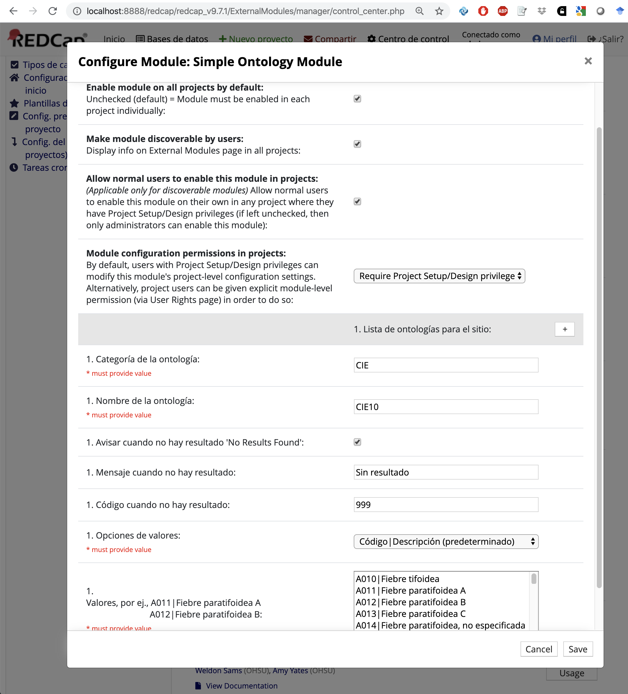

# Módulo Externo de Ontología Simple

Como parte de REDCap v8.8.1 se agregó un punto de extensión para permitir que módulos externos puedan ofrecer 
servicios de ontologías (Ontology Provider). Funciona como el mecanismo del BioPortal de ontología, pero permite cargar terminologías/vocabularios propios.
La función principal de un proveedor de ontologías es la de recibir un término de búsqueda y devolver un código y descripción.

Este módulo externo es un ejemplo muy sencillo que muestra esta funcionalidad. 
Se puede configurar para aportar una colección de valores para toda la instalación de REDCap o a nivel de proyecto que se pueden referenciar dentro de los formularios.


## Configuración del módulo
El módulo debe colocarse en la carpeta de módulos:
redcap/modules/simple-ontology_provider_v0.3.x

El módulo será visible en REDCap, en Módulos Externos.

La configuración se usa para seleccionar las ontologías que usará localmente. Si la ontología se añade en la configuración del Centro de Control
estará disponible en todos los proyectos. Las ontologías específicas para el proyecto se añaden como ajustes del proyecto
para el módulo. Si coloca la misma ontología en los módulos externos del centro de control y del proyecto, usará la del proyecto.

No hay límite en el número de ontologías que puede agregar, usando los siguientes campos:

 * `Categoría de la ontología` - Este es el nombre interno para la ontología y debe ser exclusiva para esa ontología.
 * `Nombre de la ontología` - Este es el nombre que se presentará cuando seleccione la ontología en el Diseñador en-línea.
 * `Avisar cuando no hay resultado 'No Results Found'` - Esta casilla se usa para indicar que debe retornar un valor especial si no existen resultados de la búsqueda.
 El propósito de esto es permitir que se seleccione la opción y luego activar un campo adicional a través de lógica de ramificación para recibir datos adicionales.
 También se puede usar para seleccionar un valor predeterminado.
 * `Mensaje cuando no hay resultado` - El valor a mostrar para el valor especial devuelto si se habilita la opción `Responder que no se hallaron resultados`.
 * `Código cuando no hay resultado` - El valor a mostrar para el valor especial devuelto si se habilita la opción `Responder que no se hallaron resultados`.
 * `Opciones de valores` - Esto se usa para indicar cómo se presentarán los valores. Las opciones son:
    * `list` - Una lista de valores, separados por una línea nueva. El valor y la descripción son iguales.
    * `bar` - Una lista de códigos y descripciones usando '|' como separador. Cada uno está separado con una línea. OJO: la búsqueda se hace sobre la descripción, no sobre el código.
    * `json` - Un grupo de objetos JSON con valor y descripción. Puede contener otros campos, pero solo se usará el código (code) y la descripción (display). Por ejemplo:
```
[
 { "code" : "Primer Director",      "display" : "William Hartnell",      "periodo" : "1963-11-23 1966-10-29" },
 { "code" : "Segundo Director",     "display" : "Patrick Troughton",     "periodo" : "1966-10-29 1969-06-21" },
 { "code" : "Tercer Director",      "display" : "Jon Pertwee",           "periodo" : "1970-01-03 1974-06-08" },
 { "code" : "Cuarto Director",      "display" : "Tom Baker",             "periodo" : "1974-06-08 1981-03-21" },
 { "code" : "Quinto Director",      "display" : "Peter Davison",         "periodo" : "1981-03-21 1984-03-16" },
 { "code" : "Sexto Director",       "display" : "Colin Baker",           "periodo" : "1984-03-16 1986-12-06" },
 { "code" : "Séptimo Director",     "display" : "Sylvester McCoy",       "periodo" : "1987-09-07 1989-12-06" }
]
```
 * `Valores` - Los valores que se importarán en la ontología. El formato depende del tipo de valores seleccionado.



El autocompletar implementado por el módulo hará una búsqueda de texto sencilla de la descripción para el texto ingresado. 
Colocará los valores coincidentes que empiezan con el texto buscado y con el texto dentro de la descripción.


## Proveedor de ontología

Para convertirse en un proveedor de ontología, un módulo externo debe:

  * Implementar la interfaz de proveedor de ontología
  * Registrarse con el Gestor de ontologías
  * Registrarse para cada 'page hook'. (El Diseñador en línea no tiene sus propios 'hooks')

### Interfaz del proveedor de ontología

Un proveedor de ontología permite que un tercero ofrezca una o más ontologías, como lo hace Bioportal o fhir.

Esta ontología se especifica en la definición de un campo como el enum_element y se mantendrá persistente usando la 
forma servicio:categoría

El nombre del servicio se usa para determinar cuál proveedor de ontología se debe usar.

#### Seleccionando la ontología:

Seleccionar la ontología es un proceso de dos pasos, primero se selecciona un servicio de la lista de proveedores disponibles 
y esto permitirá la selección de una categoría del servicio. El proveedor debe producir una secuencia que existirá dentro de 
un div oculto para el servicio que que se mostrará cuando el servicio se muestre, este div contendrá los elementos ui para 
seleccionar la categoría del servicio. Una vez hecha la selección, la ui debe llamar una función javascript 
update_ontology_selection($service, $category), que habilitará un elemento de forma oculto usado para configurar el valor en el campo.
De manera adicional, el proveedor podría querer incluir una función javascript
que será llamada cuando el campo se poble para que la ui pueda reflejar la selección actual. Esta función debe tomar la forma <service>_ontology_changed(service, category).

#### Búsqueda dentro de una ontología:

   El proveedor aporta el mecanismo usado por autocompletar para que busque la ontología. Este método hace que
   cualquier petición ajax devuelva los valores y la etiqueta que va junto con la selección.

## Configuración predeterminada

Estos son los valores predeterminados. No hace falta modificarlos en una instalación normal

```
interface OntologyProvider {

  /**
    * return the name of the ontology service as it will be display on the service selection
    * drop down.
    */
  public function getProviderName();

  /**
    return the prefex used to denote ontologies provided by this provider.
   */
  public function getServicePrefix();

  /**
    * Return a string which will be placed in the online designer for
    * selecting an ontology for the service.
    * When an ontology is selected it should make a javascript call to 
    * update_ontology_selection($service, $category)
    *
    * The provider may include a javascript function
    * <service>_ontology_changed(service, category)
    * which will be called when the ontology selection is changed. This function
    * would update any UI elements is the service matches or clear the UI elemements
    * if they do not.
    */
  public function getOnlineDesignerSection();

  /**
   * Search API with a search term for a given ontology
   * Returns array of results with Notation as key and PrefLabel as value.
   */
  public function searchOntology($category, $search_term, $result_limit);


  /**
   *  Takes the value and gives back the label for the value.
   */
  public function getLabelForValue($category, $value);
```

### Registro con el Gestor de ontologías

Una vez que un módulo externo tiene la implementación de Proveedor de ontologías, el siguiente paso 
es asegurar que el proveedor está registrado para el uso. Esto se hace usando el código 
```
      // register with OntologyManager
      $manager = \OntologyManager::getOntologyManager();
      $manager->addProvider($provider);
```

### Registro para un every page hook
Para que el proveedor de ontologías esté disponible el módulo externo necesita registrarse para 
redcap_every_page hook. En este módulo el proveedor de ontologías está registrado cuando se construye 
el módulo, por lo que nada debe suceder durante la función hook, puesto que el registro ya se llevó a cabo.

En el archivo config.json del módulo externo añada:
```
"permissions": [
        "redcap_every_page_before_render"
    ],
```

En el módulo externo añada:
```
 public function redcap_every_page_before_render ( $project_id ){
  }
```
