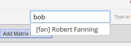
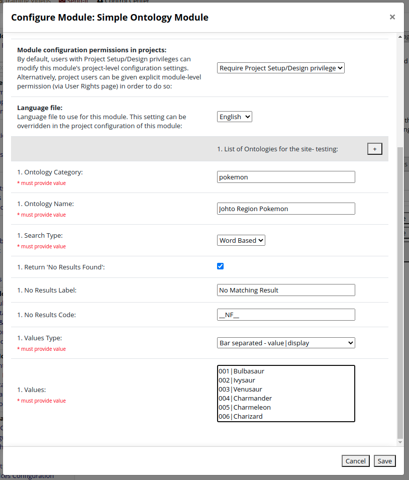
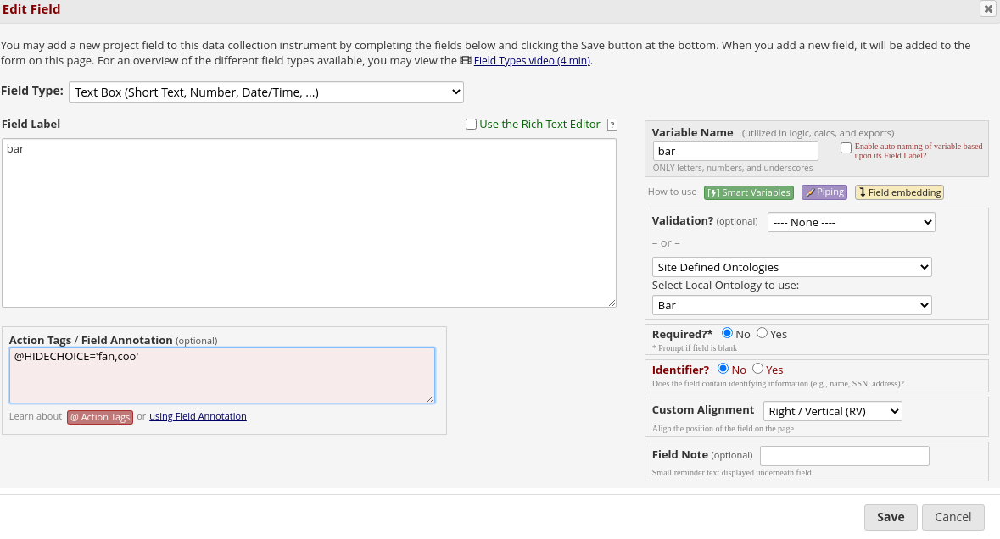

# Simple Ontology External Module

This redcap external module allows the definition of a custom set of 'ontologies' which can be used to provide
autocomplete functionality for a text field. Ontologies can be defined at a site or project level, and a default value
can be specified to be returned if no match is found. Since version 0.4, an option has been added to select to swap
between word based searching and a full match with all entered text.

Version 0.5 introduces support for synonyms and marking entries as inactive.


Dr Daniel Hinostroza from Hospital de Especialidades Carlos Andrade Marín very kindly wrote a Spanish
translation for this module, you can find the readme here: [Documentación en español](?prefix=simple_ontology_provider&page=README.es.md)
[Github Documentación en español](https://github.com/aehrc/redcap_simple_ontology_provider/blob/v0.5/README.es.md)
Thanks to Alejandro Metke Jimenez for updating the Spanish readme for version 0.4 and 0.5.

The module is licensed under CSIRO Open Source Software Licence Agreement (a variation of the BSD / MIT License).

## Using the module
Default option: download the module from the REDCap External Module Repo

Option 2: download the module from Github and expand the .zip file into the modules folder, i.e., redcap/modules/simple_ontology_provider_v0.5. 
The module will then become visible within the REDCap external modules.

In both cases, this should allow configuration and the added benefit of receiving notifications whenever the module is updated within the Repo.

The settings for the module are used for specifying ontologies. If an ontology is added in the site settings
for the module it will be available for all projects. Project specific ontologies are added as project settings
for the module. If an ontology with the same category is defined in both the site and project settings the project
settings will take precedence.

Any number of ontologies can be added, using the follow fields:

 * `Ontology Category` - This is the internal name for the ontology, and should be unique for the ontology.
 * `Ontology Name` - This is the name that will be presented when choosing the ontology in the online designer.
 * `Search Type` - This drop down is used to select the search algorithm to use. The choices are:
    * `Word Based` - This is the search mechanism introduced in version 0.3, each word is search separately.
    * `Full Match` - The full text is searched with no special behaviour for words.
 * `Return 'No Results Found'` - This check box is used to indicate that a special value should be returned if no values
  are returned by a search. The purpose of this is to allow the option to be selected and then have an additional field
  get activated via branching logic to receive additional data. It can also be used to fall  back to some default value.
 * `No Results Label` - The display value for the special value returned if the `return no results found` option is enabled.
 * `No Results Code` - The value for the special value returned if the `return no results found` option is enabled.
 * `'No Results Found' result count` - An integer value indicating the search result count under which the special no
    result found value will be included in the results. For example a value of 5, would mean if the search found 5 or
    fewer matches than the no result value also appear in the search results. The search will only return a maximum of
    20 results even if there are more matches, this setting cannot exceed 19.
 * `Values Type` - This is used to indicate how the values will be provided. The options are:
    * `list` - A list of values, seperated by a new line. The value and display will be the same value.
    * `bar` - A list of value|display using a '|' as the separator. Entries are separated with a new line.
    * `json` - A json array of objects with a code and display. The json can contain other fields, only code and display will be used. Example json:
```
[
 { "code" : "First Doctor",      "display" : "William Hartnell",      "period" : "1963-11-23 1966-10-29" },
 { "code" : "Second Doctor",     "display" : "Patrick Troughton",     "period" : "1966-10-29 1969-06-21" },
 { "code" : "Third Doctor",      "display" : "Jon Pertwee",           "period" : "1970-01-03 1974-06-08" },
 { "code" : "Forth Doctor",      "display" : "Tom Baker",             "period" : "1974-06-08 1981-03-21" },
 { "code" : "Fifth Doctor",      "display" : "Peter Davison",         "period" : "1981-03-21 1984-03-16" },
 { "code" : "Sixth Doctor",      "display" : "Colin Baker",           "period" : "1984-03-16 1986-12-06" },
 { "code" : "Seventh Doctor",    "display" : "Sylvester McCoy",       "period" : "1987-09-07 1989-12-06" },
 { "code" : "Eighth Doctor",     "display" : "Paul McGann",           "period" : "1996-05-27 1996-05-27" },
 { "code" : "Ninth Doctor",      "display" : "Christopher Eccleston", "period" : "2005-03-26 2005-06-18" },
 { "code" : "Tenth Doctor",      "display" : "David Tennant",         "period" : "2005-06-18 2010-01-01" },
 { "code" : "Eleventh Doctor",   "display" : "Matt Smith",            "period" : "2010-01-01 2013-12-25" }, 
 { "code" : "Twelfth Doctor",    "display" : "Peter Capaldi",         "period" : "2013-12-25 2017-12-25" },
 { "code" : "Thirteenth Doctor", "display" : "Jodie Whittaker",       "period" : "2017-12-25" }
]
```
 * `Values` - The actual values in the set. The format will depend on the Values Type chosen.


### Synonyms
Version 0.5 of the module introduces support for synonyms. A synonym is an alternative text representation for
the code. The synonym text will also be search, but the display will always be returned.

Synonyms can be added using the bar and json formats. For the Bar format, the synonyms are added by using more bars to
separate the synonyms. For example:
```text
fan|Robert Fanning|Bob Fanning|fan
che|Justine Brown|Justine Chen|Jai Li Chen|che
coo|Cooper Derricks|coo
col|Morty Cole|col
```
Adds the code as a search term, but also adds alternative versions of names. Any number of synonyms can be added, but
for bar delimited they still must be on the same line. For json format, the attribute 'synonyms' is used to provide an
array of synonyms.
```json
[
{"code": "fan", "display": "Robert Fanning", "synonyms": ["Bob Fanning", "fan"]},
{"code": "che", "display": "Justine Brown", "synonyms": ["Justine Chen", "Jai Li Chen", "che"]},
{"code": "coo", "display": "Cooper Derricks", "synonyms": ["coo"]},
{"code": "col", "display": "Morty Cole", "synonyms": ["col"]}
]
```
This is the equivalent in json format.




### Active flag
Version 0.5 of the module introduces support for an active flag being associated with an entry. An entry set to 
active=false will not appear in the searched list, but is still a member of the ontology and so will appear if the
value has been used in the past.

How an entry is marked as not active depends on the format used to enter the values.
If the values type is `list` or `bar` then the entry is marked as active=false by adding a `!` character at the
start of the line. If the code starts with a `!` then is can be escaped with a `\`  
```text
fan|Robert Fanning|Bob Fanning|fan
che|Justine Brown|Justine Chen|Jai Li Chen|che
coo|Cooper Derricks|coo
!col|Morty Cole|col
\!escape|Code with an leading !
```
In the Bar example above, Morty Cole is considered not active and will not show as choice when selecting from the
ontology. The `!escape` code needs to be escaped with a leading `\`

For `json` values, the value is added using an `active` attribue.
```json
[
{"code": "fan", "display": "Robert Fanning", "synonyms": ["Bob Fanning", "fan"]},
{"code": "che", "display": "Justine Brown", "synonyms": ["Justine Chen", "Jai Li Chen", "che"]},
{"code": "coo", "display": "Cooper Derricks", "synonyms": ["coo"]},
{"code": "col", "display": "Morty Cole", "active": false, "synonyms": ["col"]}
]
```
This is the equivalent in json format. If active is missing or set to something else then the entry will be considered 
active.



## Word based searching
The autocomplete implemented by the module will do a simple text search of the display text for the entered text.
In version 0.3 a word based search mechanism was implemented, but in version 0.4 a new option has been added to chose
between the word based search or a simple full text match.
For the word based search, rather than looking for an exact string match, the module will search for each word in the 
autocomplete query separately and return all matches sorted by found word count then found position.
This behaviour has the side effect that part matches may not be hilighted in the UI. The REDCap autocomplete UI takes
the search term used and hilights the matching part of the text in the dropdown. 

So if you search for coronav and get a return list of
- Avian *Coronav*irus
- Bovine *Coronanv*irus
- Canine *CoronanV*irus

The 'coronav' section of each choice will be hilighted.

But if you search for 'tuberculosis bacterial' and get a return list of  
- 10044772: Tuberculosis of adrenal glands, confirmed by bacterial culture
- 10044780: Tuberculosis of bladder, confirmed by bacterial culture
- 10044799: Tuberculosis of ear, confirmed by bacterial culture

No hilighting will be shown in the UI, as only a full text match is emphasised. 


The module parses the codes and displays into an associative array before returning search results.
If multiple entries have the same code, then the last entry will overwrite any existing entries. 

## @HIDECHOICE support
As part of the 0.5 release extra functionality has been added to this module for it to consider the `@HIDECHOICE`
action tag. This action tag is available for choice fields to indicate a choice should not be shown. This
can be achieved at an global level in this module by using the active flag to mark an code as not active. The
@HIDECHOICE action tag however is specified at a field level. So the value will only be hidden for the field the
action tag is specified for. The set of values to hide is defined using a comma separated list of code for the
values which should be hidden. The module considers all @HIDECHOICE entries found in the annotations property of the
field.
```text
@HIDECHOICE='code1,code2'
```


# Ontology Provider

As part of release 8.8.1 of REDCap an extension point was added to allow external modules to become an 
*'Ontology Provider'*. These act like the existing BioPortal ontology mechanism, but allow alternative sources.
The main function of an ontology provider is to take a search term and return some match of code + display.
This module is a very simple example of an external module which provides this functionality. 

To become an ontology provider an external module needs to :

  * Implement the OntologyProvider interface
  * Register with the Ontology Manager
  * Register for an every page hook. (The online designer doesn't have its own hooks)

### OntologyProvider Interface

An ontology provider allows a thrid party service such as bioportal or fhir to provide one or more ontologies.

This ontology is specified in the definition of a field as the enum_element and will be persisted using the 
form service:category

The service name is used to determine which ontology provider to use.

#### Choosing the ontology:

Selecting an ontology for a field is a two step process, firstly a service
is selected from the list of available providers and this will allow the selection of
a catergory from the service. The provider needs to produce a string which will
live in a hidden div for the service that will be shown when the service is shown,
this div will contain ui elements for selecting the category from the service. Once
a selection if made, the ui needs to call a javascript function
update_ontology_selection($service, $category), this will set a hidden form element used
to set the value on the field. Additionally the provider may want to include a javascript
function which will be called when the field is populated so that the ui can reflect the
current selection. This function should take the form <service>_ontology_changed(service, catgeory).

#### Searching the ontology:
   The provider needs to supply a mechanism which will be used by the autocomplete to
   search the ontology. This method would make any required ajax calls to return a set of
   values and a label to go with the selection.

```
interface OntologyProvider {

  /**
    * return the name of the ontology service as it will be display on the service selection
    * drop down.
    */
  public function getProviderName();

  /**
    return the prefex used to denote ontologies provided by this provider.
   */
  public function getServicePrefix();

  /**
    * Return a string which will be placed in the online designer for
    * selecting an ontology for the service.
    * When an ontology is selected it should make a javascript call to 
    * update_ontology_selection($service, $category)
    *
    * The provider may include a javascript function
    * <service>_ontology_changed(service, category)
    * which will be called when the ontology selection is changed. This function
    * would update any UI elements is the service matches or clear the UI elemements
    * if they do not.
    */
  public function getOnlineDesignerSection();

  /**
   * Search API with a search term for a given ontology
   * Returns array of results with Notation as key and PrefLabel as value.
   */
  public function searchOntology($category, $search_term, $result_limit);


  /**
   *  Takes the value and gives back the label for the value.
   */
  public function getLabelForValue($category, $value);
```

### Register with the Ontology Manager

Once an external module has an implementation of OntologyProvider the next step is to ensure the provider is
registered for use. This is done by using the code 
```
      // register with OntologyManager
      $manager = \OntologyManager::getOntologyManager();
      $manager->addProvider($provider);
```

### Register for an every page hook
In order for the ontology provider to be available the external module needs to register for the redcap_every_page hook.
In this module the ontology provider is registered when the module is constructed, so nothing needs to happen during the hook
function,as the registration has already taken place.

In the config.json file of the external module add:
```
"permissions": [
        "redcap_every_page_before_render"
    ],
```

In the external module add:
```
 public function redcap_every_page_before_render ($project_id ){
  }
```


