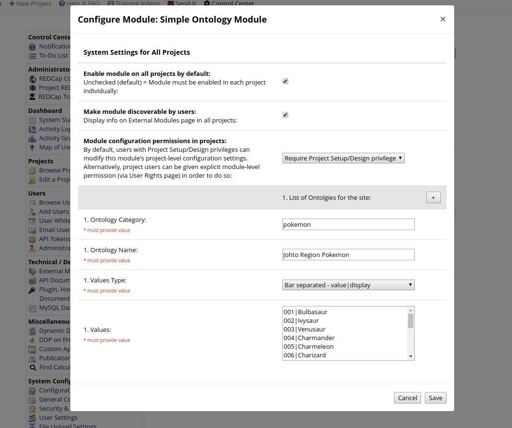

# Simple Ontology External Module

As part of release 8.8.1 of REDCap an extension point was added to allow external modules to become an 
*'Ontology Provider'*. These act like the existing BioPortal ontology mechanism, but allow alternative sources.
The main function of an ontology provider is to take a search term and return some match of code + display.

This module is a very simple example of an external module which provides this functionality. 
It can be configured to provide site or project wide collection of values that can be referenced inside forms.


## Using the module
The module code needs to be places in a directory modules/simple-ontoloy_v0.2

The module should then show up as an external module.

The settings for the module are used for specifying ontologies. If an ontology is added in the site settings
for the module it will be available for all projects. Project specific ontologies are added as project settings
for the module. If an ontology with the same category is defined in both the site and project settings the project
settings will take precedence.

Any number of ontologies can be added, using the follow fields:

 * `Ontology Category` - This is the internal name for the ontology, and should be unique for the ontology.
 * `Ontology Name` - This is the name that will be presented when choosing the ontology in the online designer.
 * `Return 'No Results Found'` - This check box is used to indicate that a special value should be returned if no values are returned by a search. The purpose of this is to allow the option to be selected and then have an additional field get activated via branching logic to receive additional data. It can also be used to fall  back to some default value.
 * `No Results Label` - The display value for the special value returned if the `return no results found` option is enabled.
 * `No Results Code` - The value for the special value returned if the `return no results found` option is enabled.
 * `Values Type` - This is used to indicate how the values will be provided. The options are:
    * `list` - A list of values, seperated by a new line. The value and display will be the same value.
    * `bar` - A list of value|display using a '|' as the seperator. Entries are seperated with a new line.
    * `json` - A json array of objects with a code and display. The json can contain other fields, only code and display will be used. Example json:
```
[
 { "code" : "First Doctor",      "display" : "William Hartnell",      "period" : "1963-11-23 1966-10-29" },
 { "code" : "Second Doctor",     "display" : "Patrick Troughton",     "period" : "1966-10-29 1969-06-21" },
 { "code" : "Third Doctor",      "display" : "Jon Pertwee",           "period" : "1970-01-03 1974-06-08" },
 { "code" : "Forth Doctor",      "display" : "Tom Baker",             "period" : "1974-06-08 1981-03-21" },
 { "code" : "Fifth Doctor",      "display" : "Peter Davison",         "period" : "1981-03-21 1984-03-16" },
 { "code" : "Sixth Doctor",      "display" : "Colin Baker",           "period" : "1984-03-16 1986-12-06" },
 { "code" : "Seventh Doctor",    "display" : "Sylvester McCoy",       "period" : "1987-09-07 1989-12-06" },
 { "code" : "Eighth Doctor",     "display" : "Paul McGann",           "period" : "1996-05-27 1996-05-27" },
 { "code" : "Ninth Doctor",      "display" : "Christopher Eccleston", "period" : "2005-03-26 2005-06-18" },
 { "code" : "Tenth Doctor",      "display" : "David Tennant",         "period" : "2005-06-18 2010-01-01" },
 { "code" : "Eleventh Doctor",   "display" : "Matt Smith",            "period" : "2010-01-01 2013-12-25" }, 
 { "code" : "Twelfth Doctor",    "display" : "Peter Capaldi",         "period" : "2013-12-25 2017-12-25" },
 { "code" : "Thirteenth Doctor", "display" : "Jodie Whittaker",       "period" : "2017-12-25" }
]
```
 * `Values` - The actual values in the set. The format will depend on the Values Type chosen.




The autocomplete implemented by the module will do a simple text search of the display text for the entered text. 
It will place matching entries which start with the search string before those entries found with the text inside the display.


## Ontology Provider

To become an ontology provider an external module needs to :

  * Implement the OntologyProvider interface
  * Register with the Ontology Manager
  * Register for an every page hook. (The online designer doesn't have its own hooks)

### OntologyProvider Interface

An ontology provider allows a thrid party service such as bioportal or fhir to provide one or more ontolgies.

This ontology is specified in the definition of a field as the enum_element and will be persisted using the 
form service:category

The service name is used to determine which ontology provider to use.

#### Choosing the ontology:

Selecting an ontology for a field is a two step process, firstly a service
is selected from the list of available providers and this will allow the selection of
a catergory from the service. The provider needs to produce a string which will
live in a hidden div for the service that will be shown when the service is shown,
this div will contain ui elements for selecting the category from the service. Once
a selection if made, the ui needs to call a javascript function
update_ontology_selection($service, $category), this will set a hidden form element used
to set the value on the field. Additionally the provider may want to include a javascript
function which will be called when the field is populated so that the ui can reflect the
current selection. This function should take the form <service>_ontology_changed(service, catgeory).

#### Searching the ontology:
   The provider needs to supply a mechanism which will be used by the autocomplete to
   search the ontology. This method would make any required ajax calls to return a set of
   values and a label to go with the selection.

```
interface OntologyProvider {

  /**
    * return the name of the ontology service as it will be display on the service selection
    * drop down.
    */
  public function getProviderName();

  /**
    return the prefex used to denote ontologies provided by this provider.
   */
  public function getServicePrefix();

  /**
    * Return a string which will be placed in the online designer for
    * selecting an ontology for the service.
    * When an ontology is selected it should make a javascript call to 
    * update_ontology_selection($service, $category)
    *
    * The provider may include a javascript function
    * <service>_ontology_changed(service, category)
    * which will be called when the ontology selection is changed. This function
    * would update any UI elements is the service matches or clear the UI elemements
    * if they do not.
    */
  public function getOnlineDesignerSection();

  /**
   * Search API with a search term for a given ontology
   * Returns array of results with Notation as key and PrefLabel as value.
   */
  public function searchOntology($category, $search_term, $result_limit);


  /**
   *  Takes the value and gives back the label for the value.
   */
  public function getLabelForValue($category, $value);
```

### Register with the Ontology Manager

Once an external module has an implementation of OntologyProvider the next step is to ensure the provider is
registered for use. This is done by using the code 
```
      // register with OntologyManager
      $manager = \OntologyManager::getOntologyManager();
      $manager->addProvider($provider);
```

### Register for an every page hook
In order for the ontology provider to be available the external module needs to register for the redcap_every_page hook.
In this module the ontology provider is registered when the module is constructed, so nothing needs to happen during the hook
function,as the registration has already taken place.

In the config.json file of the external module add:
```
"permissions": [
        "redcap_every_page_before_render"
    ],
```

In the external module add:
```
 public function redcap_every_page_before_render (int $project_id ){
  }
```


